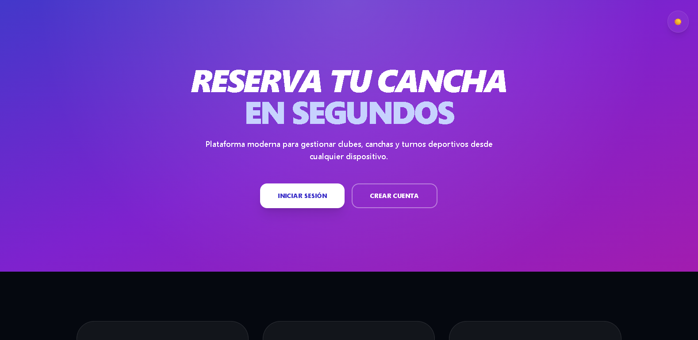
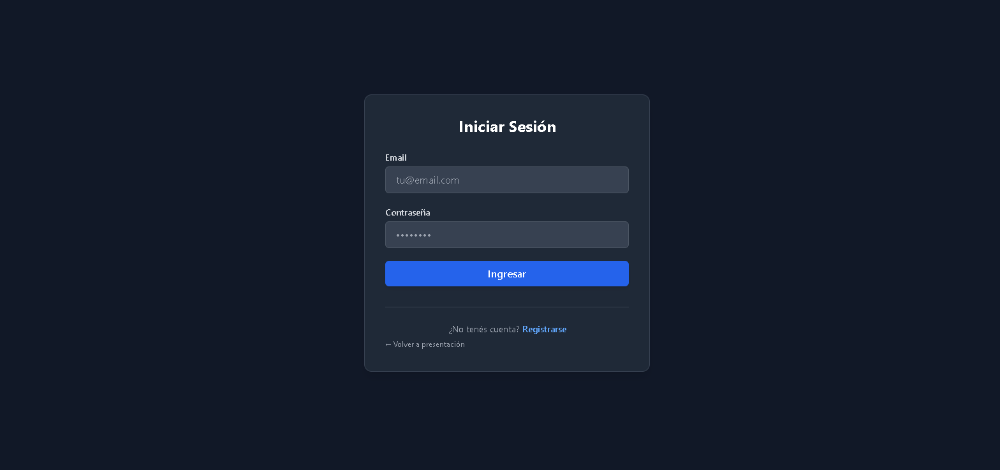
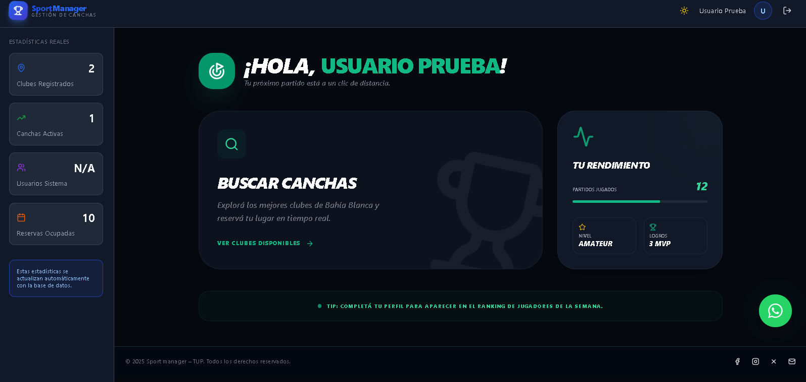
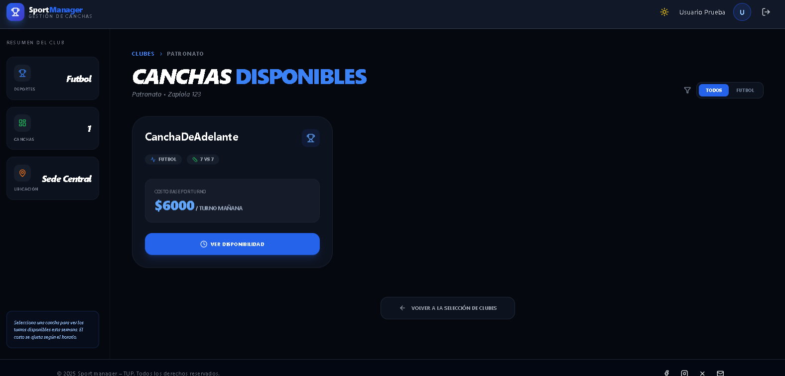
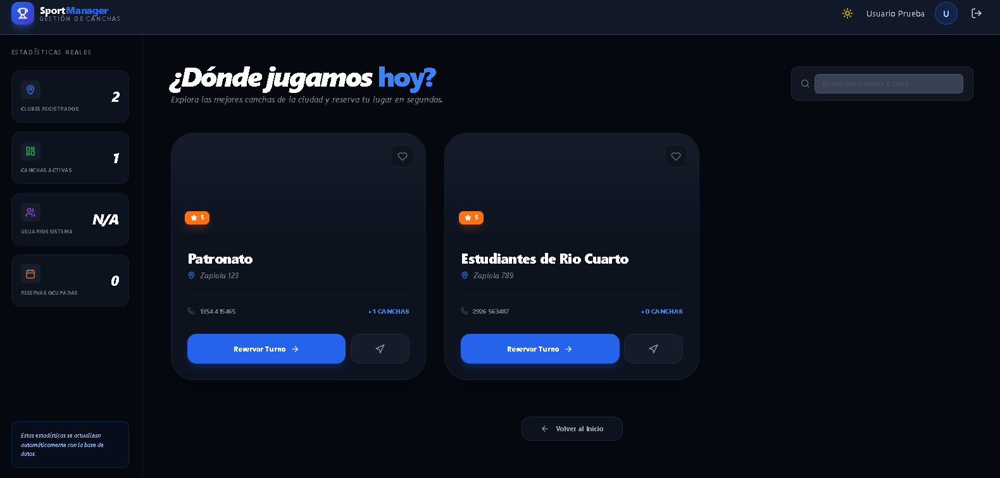
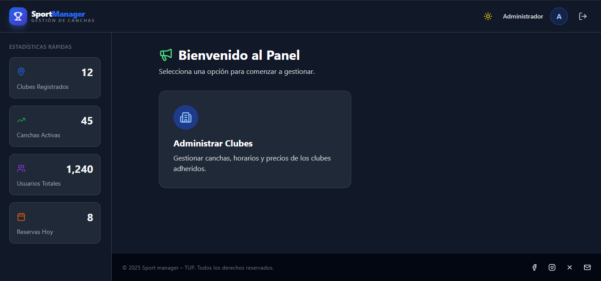
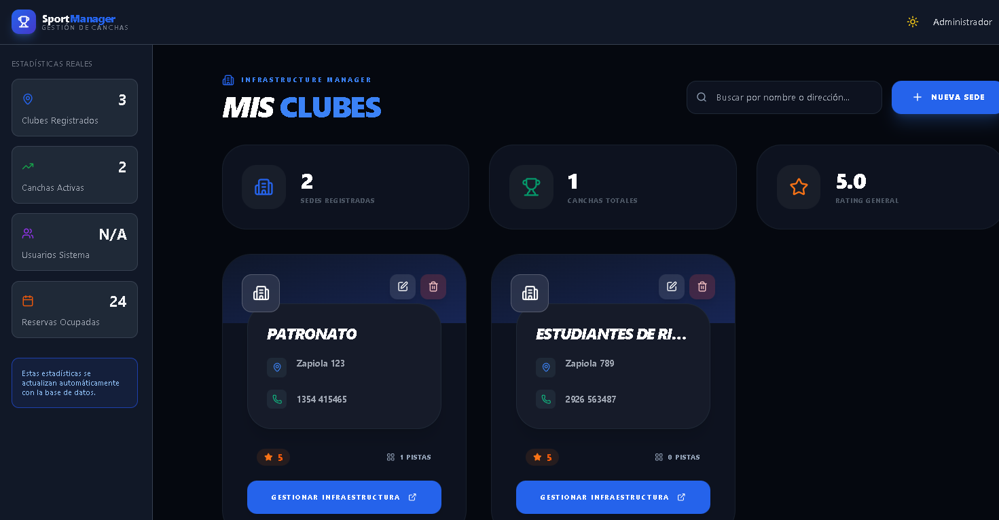
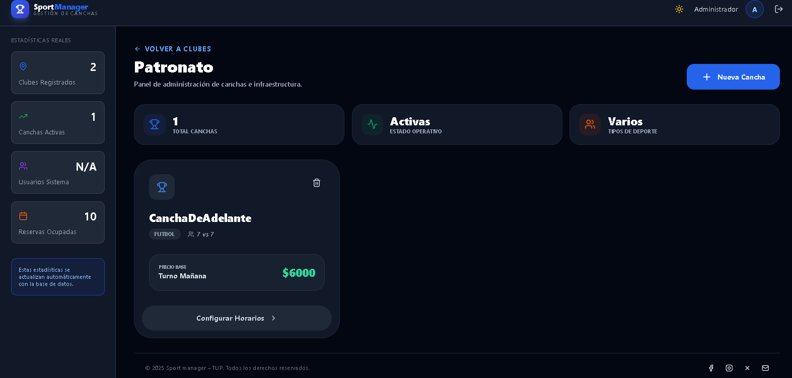
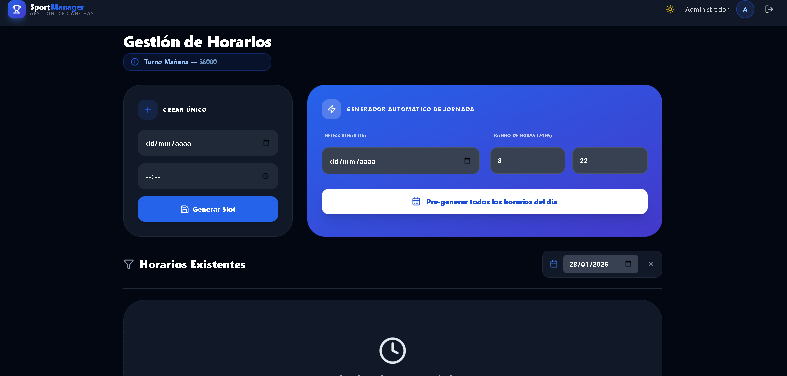

# ⚽ **Plataforma de Gestión y Reserva de Canchas — Frontend (Develop)**

### 📌 *Proyecto Final — Tecnicatura Universitaria en Programación (TUP)*

Este repositorio contiene el **Frontend** de la plataforma web para la gestión y reserva de canchas deportivas. El proyecto moderniza y digitaliza procesos que tradicionalmente se realizaban de forma manual, centralizando operaciones y mejorando la experiencia tanto de jugadores como de administradores.

------------------------------------------------------------------------

# 📖 **Descripción General**

La aplicación permite que los jugadores visualicen disponibilidad y reserven turnos, mientras que los administradores controlan clubes, canchas, precios y la agenda diaria.

✔ Reservas online en tiempo real  
✔ Gestión completa de infraestructura deportiva  
✔ Organización automática del cronograma  
✔ Interfaz moderna, adaptable y con soporte para Dark Mode  

------------------------------------------------------------------------

# 🚀 **Flujo de Navegación**

### 🌟 **Página de Presentación (Landing Page)**
Antes del ingreso, los usuarios son recibidos por una sección de presentación que destaca las ventajas de la plataforma.



------------------------------------------------------------------------

# 🔐 **Acceso al Sistema**

### 👤 **Login de Usuarios**
Sistema de autenticación seguro para los diferentes roles.



-   **Jugador:** `user@test.com` / `user123`
-   **Admin:** `admin@test.com` / `admin123`

------------------------------------------------------------------------

# 🧑‍🤝‍🧑 **Roles y Funcionalidades**

## ⚽ **Módulo Jugador — User**

El usuario puede buscar clubes, ver canchas disponibles y gestionar sus reservas de forma intuitiva.

- 🔍 **Búsqueda:** Exploración de clubes en la zona.
- 📅 **Disponibilidad:** Consulta de horarios libres.
- 🕒 **Reserva:** Proceso ágil de reserva.





------------------------------------------------------------------------

## 🏟️ **Módulo Administrador — Admin**

Herramientas potentes para la gestión total del club.

- 🏗️ **Infraestructura:** Gestión de canchas y clubes.
- 🗓️ **Agenda:** Control detallado de horarios y turnos.
- ⚙️ **Operaciones:** Edición de datos en tiempo real.






------------------------------------------------------------------------

# 🖥️ **Tecnologías Utilizadas**

-   **Framework:** React 18 + Vite
-   **Lenguaje:** TypeScript
-   **Estilos:** TailwindCSS + Framer Motion (Animaciones)
-   **Iconografía:** Lucide React
-   **Estado/Rutas:** Context API + React Router DOM

------------------------------------------------------------------------

# 🛠️ **Instalación y Uso (Local)**

```bash
# 1. Clonar el repositorio
git clone [https://github.com/Fausto-Desch/Proyecto-Final.git](https://github.com/Fausto-Desch/Proyecto-Final.git)

# 2. Entrar a la carpeta
cd Proyecto-Final

# 3. Instalar dependencias
npm install

# 4. Iniciar entorno de desarrollo
npm run dev